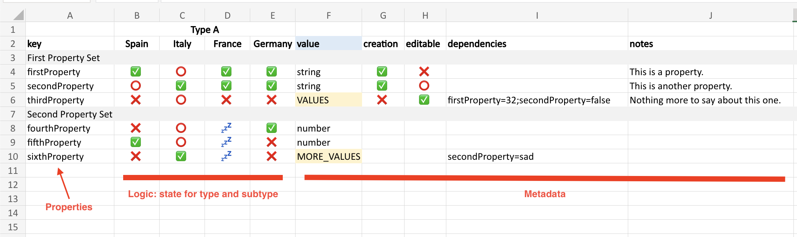

# Model Playground

This CLI contains tools to manage models.

It's based on [Bun](https://bun.sh), so you need to install it to use the CLI. Don't worry, its cool 😁

Clone the repo and install it locally as global application: `npm install -g .`. To install dependencies run `bun install`.

Then use one of the available commands.

## Extract

This command requires a file with a name ended in `model.xlsx` or `values.xlsx` depending if it is a model file or a values file. You can also add a `-p`, `--path` option to tell the tool where to create the parsed file.

The parsed files will be `JSON` files that can be used through the model hooks: `useModel` and `useValues` (in `src/tools`).

## Model

The model lives in an Excel file. Easy to read, easy to edit. It contains a list of properties that apply on types over subtypes (in this case, countries).

> A certain property applies with a certain state for a type and a certain subtype.
>
> * ✅ -> Required
> * ⭕️ -> Optional
> * ❌ -> Not required
> * 💤 -> To be defined

The rest of the values are metadata, and store as metadata object that can be readed and used for as much additional information as needed.

